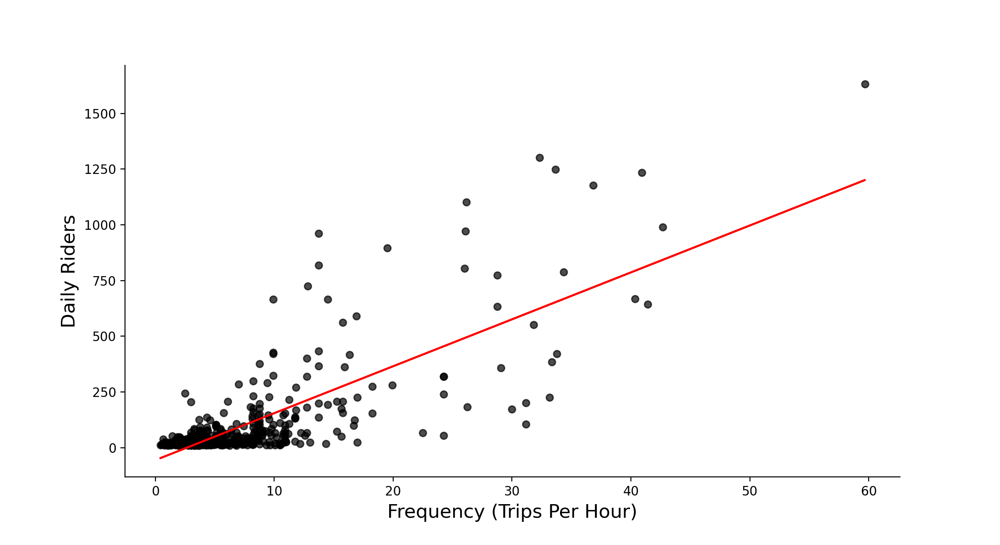

# Frequency of Bus Routes 

## General Overview

The book 'Human Transit' highlighted the importance of 'frequency' to a transit system. Frequency is not only a key measurement of the level of service of transit, but it is also relatable to the general public as it can be easily converted into average waiting time between buses.

There are two types of frequency: by Route or by Stop. Let's start with frequency by Route.

## Figure 1: Route Frequency over a Day:

This plot shows the aggregate frequency at an hourly interval over the day for both a Weekday and Weekend. It can observed that the Transit service starts at 4:00 AM for both weekdays and weekends. The level of service during a weekday evidently higher at every time of the day, but this is especially true from around 8:00 AM to 6:00 PM. There are also clear peaks of frequency during the weekday, at the 8:00 to 9:00 AM interval and the 4:00 to 6:00 PM interval. These are often times when people are either going to work or going back home from work. An increased demand of transit service is met with an increase in the level of service itself. This brings up the question: are there any other intervals of time during the day in which high demand is met with low levels of service, or vice-versa? This could be an area of focus in the future, but it will be rather difficult to achieve without hourly ridership data (an indicator of transit demand)

## Figure 2: High Frequency Routes:

This plot shows the 6 highest frequency bus routes (by weekday) in Madison. This is here to get a general idea of which routes have the highest frequency. While the locations each route stops by are certainly important, their level of service is measured instead by frequency. However, routes with a higher frequency also takes more financing to maintain, so we would expect them to also have higher levels of ridership. This expectation is visualized in the next plot.

## Figure 3: Route Frequency against Ridership:

This plot attempts to show the relationship between the daily ridership and frequency (in trips/hour), where every point in the scatterplot is a Route. A positive relation can be observed, but there are clear outliers in the data. For example, towards the bottom right of the plot, there is a Route which has a frequency of 6 trips per hour, a number that is relatively high compared to most bus routes. However, it only has a daily ridership of just over 500. Initially, routes that are further below the linear regression line may seem to indicate high levels of service (frequency) but a low demand (ridership), and hence a degree of inefficiency with the transit budget. However, as in the book 'Human Transit', it mentions that not all bus routes are designed to have their buses filled as much as possible (indicated by ridership/frequency). A conclusion that a route is inefficient (low ridership/frequency) or needs to be more frequent (high ridership/frequency, buses always filled) must be observed on an individial route basis.

Another point I mentioned earlier is that it would be interesting to once again compare ridership and frequency but this time on an hourly rather than daily analysis. This could lead to proposals of when exactly to increase the frequency of routes or when to decrease it. Optimally, if ridership maximisation is the goal, fluctuations in transit demand throughout the day should be met with changes in transit frequency as well.

Moving on to frequency in regards to individual bus stops:

## Figure 4: Stop Frequency against Ridership

The plot shows the relationship between Stop Frequency and its Daily Ridership. Each point on the scatterplot represents a Metro Transit bus stop in Madison. There is a positive correlation evident between the two, especially for stops with higher frequency. The plot also shows that the majority of bus stops in Madison operate with a frequency of less than 15 trips per hour, each taking in less than 250 riders a day. Many stops even seem to only take in less than 5 riders a day. The idea of the ratio of daily ridership to frequency was previously brought up as a potential measurement of the efficiency of a system (stop or route). The next plot helps better visualize where the relatively efficient bus stops are located in Madison.

## Figure 5: Map of Efficient and Inefficient Stops in Madison

The plot depicts the position of efficient and inefficient bus stops in Madison. Efficient stops are determined here as bus stops that are above the linear regression line in the previous plot, and the inefficient below it. Around the UW campus, the majority of bus stops are efficient bus stops, likely because UW students are densely located in that general area. Students and teachers will also usually use the bus as a means of travel rather than driving a car the distance they travel aren't too far (only between buildings in the UW campus). The bus also allows them the freedom of not needing to park their car. While this plot shows the efficiency of bus stops, the next focuses more on how often a stop is used.

## Figure 6: Stops with more than 5 riders a day

Then plot depicts the position of stops that take in more than 5 riders a day. Once again, stops that take in more than 5 riders a day are most common around the UW campus area, likely for the same reasons as mentioned above. As we move away from the campus area, there is an noticably high number of bus stops that do not even have 5 riders a day. While it may initially seem as if those stops are redundant, this is certainly not always the case. Similar to how certain bus routes have the goal of coverage rather than maximising ridership, the same could be said for bus stops.

## Figure 7: 

