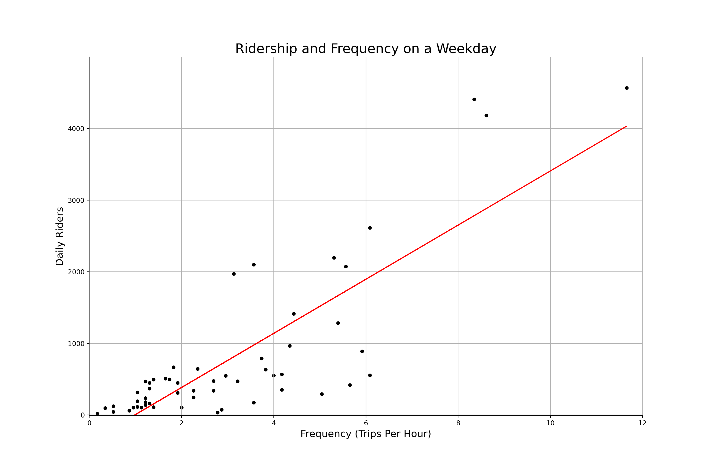
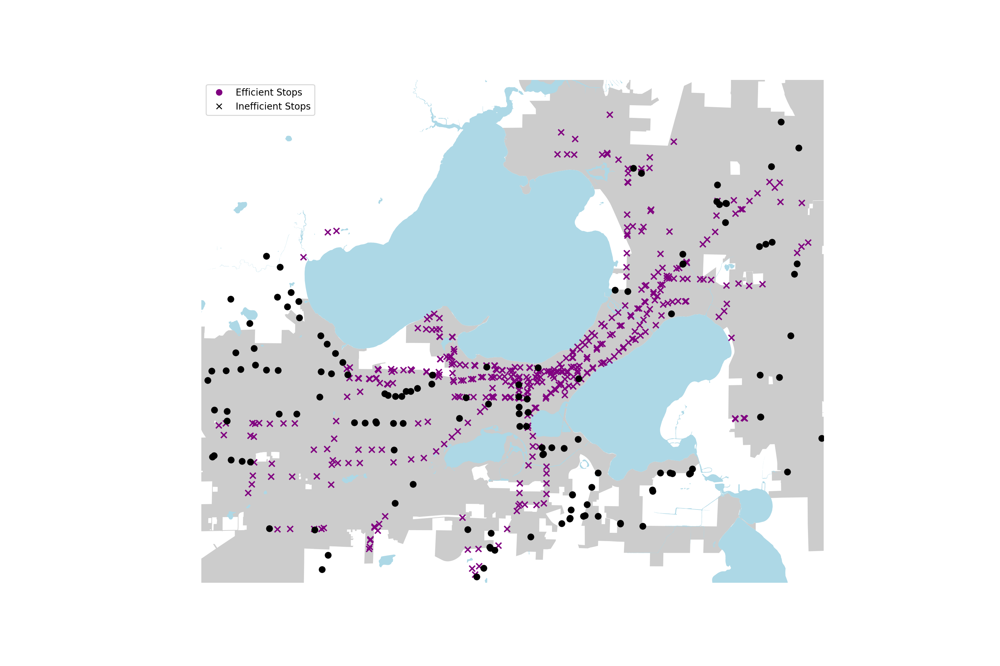

# Frequency of Bus Routes 

## General Overview

A lot of my process in this part was in the cleaning of the data; The book 'Human Transit' highlighted the importance of 'frequency' to a transit system. Frequency is not only a key measurement of the level of service of transit, but it is also relatable to the general public as it can be easily converted into average waiting time between buses.

There are two types of frequency: by Route or by Stop. Let's start with frequency by Route.

## Plot 1:

This plot shows the aggregate frequency at an hourly interval over the day for both a Weekday and Weekend. It can observed that the Transit service starts at 4:00 AM for both weekdays and weekends. The level of service during a weekday evidently higher at every time of the day, but this is especially true from around 8:00 AM to 6:00 PM. There are also clear peaks of frequency during the weekday, at the 8:00 to 9:00 AM interval and the 4:00 to 6:00 PM interval. These are often times when people are either going to work or going back home from work. An increased demand of transit service is met with an increase in the level of service itself. This brings up the question: are there any other intervals of time during the day in which high demand is met with low levels of service, or vice-versa? This could be an area of focus in the future, but it will be rather difficult to achieve without hourly ridership data (an indicator of transit demand)

## Plot 2:

This plot shows the 6 highest frequency bus routes (by weekday) in Madison. This is here to get a general idea of which routes have the highest frequency. While the locations each route stops by are certainly important, their level of service is measured instead by frequency. However, routes with a higher frequency also takes more financing to maintain, so we would expect them to also have higher levels of ridership. This expectation is visualized in the next plot.

## Plot 3:

This plot attempts to show the relationship between the daily ridership and frequency (in trips/hour), where every point in the scatterplot is a Route. A positive relation can be observed, but there are clear outliers in the data. For example, towards the bottom right of the plot, there is a Route which has a frequency of 6 trips per hour, a number that is relatively high compared to most bus routes. However, it only has a daily ridership of just over 500. Initially, routes that are further below the linear regression line may seem to indicate high levels of service (frequency) but a low demand (ridership), and hence a degree of inefficiency with the transit budget. However, as in the book 'Human Transit', it mentions that not all bus routes are designed to have their buses filled as much as possible (indicated by ridership/frequency). A conclusion that a route is inefficient (low ridership/frequency) or needs to be more frequent (high ridership/frequency, buses always filled) must be observed on an individial route basis.

Another point I mentioned earlier is that it would be interesting to once again compare ridership and frequency but this time on an hourly rather than daily analysis. This could lead to proposals of when exactly to increase the frequency of routes or when to decrease it. Optimally, if ridership maximisation is the goal, fluctuations in transit demand throughout the day should be met with changes in transit frequency as well.

##

## Map of Efficient and Inefficient Stops in Madison

