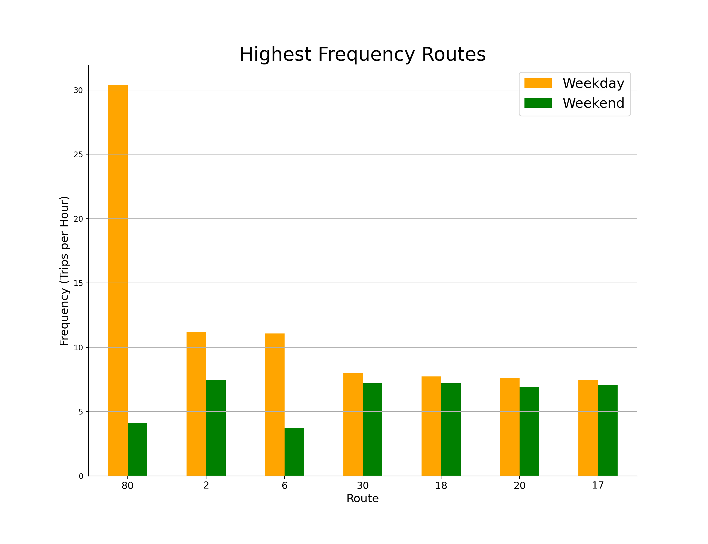

# 9/28 Report: Frequency of Bus Routes 

## General Overview

For this week, I used the GTFS data from the City of Madison website. A lot of my process was in the cleaning of the data; The book 'Human Transit' highlighted the importance of 'frequency' to a transit system. Frequency is not only a key measurement of the level of service of transit, but it is also relatable to the general public as it can be easily inversed to average waiting time between buses.

There are two types of frequency: by Route or by Stop. I chose to do the route frequency for this week. 

## Plot 1:

